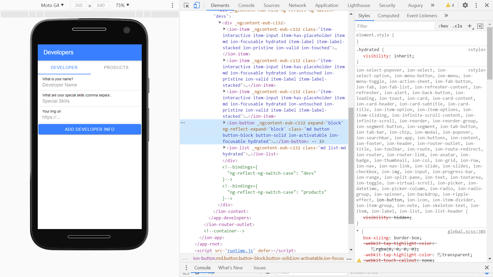

# Ionic Angular SQLite

* App to store data using the [Ionic framework](https://ionicframework.com/docs), [cordova SQLite database](https://ionicframework.com/docs/native/sqlite) & [SQLite Porter](https://ionicframework.com/docs/native/sqlite-porter) and [Capacitor](https://capacitor.ionicframework.com/).
* **Note:** to open web links in a new window use: _ctrl+click on link_


## Table of contents

* [:zap: Ionic Angular SQLite](#zap-ionic-angular-sqlite)
  * [:page_facing_up: Table of contents](#page_facing_up-table-of-contents)
  * [:books: General info](#books-general-info)
  * [:camera: Screenshots](#camera-screenshots)
  * [:signal_strength: Technologies](#signal_strength-technologies)
  * [:floppy_disk: Setup](#floppy_disk-setup)
  * [:computer: Code Examples](#code-examples)
  * [:cool: Features](#features)
  * [:clipboard: Status & To-Do List](#status--to-do-list)
  * [:clap: Inspiration](#inspiration)
  * [:file_folder: License](#file_folder-license)
  * [:envelope: Contact](#contact)

## General info

* App allows user to add details of developer and products.
* Initial seed data is a short list of developers and dev skills.

## Screenshots




## Technologies

* [Ionic/angular v6](https://ionicframework.com/)
* [Ionic v6](https://ionicframework.com/docs/cli)
* [Angular v15](https://angular.io/)
* [cordova plugin SQLite database v6](https://ionicframework.com/docs/native/sqlite)
* [cordova SQLite Porter v6](https://ionicframework.com/docs/native/sqlite-porter)

## Setup

* Run `npm i` to install dependencies
* To start the server on _localhost://8100_ type: 'ionic serve'

## Code Examples

* `database.service.ts` function to get details of a developer from the database that return a promise of format Dev

```typescript
getDeveloper(id): Promise<Dev> {
  return this.database.executeSql('SELECT * FROM developer WHERE id = ?', [id]).then(data => {
    let skills = [];
    if (data.rows.item[0].skills !== '') {
      skills = JSON.parse(data.rows.item[0].skills);
    }

    return {
      id: data.rows.item(0).is,
      name: data.rows.item(0).name,
      skills,
      img: data.rows.item[0].img
    };
  });
}
```

## Features

* storage of data in an SQL database.

## Status & To-do list

* Status: compiles and displays in a dev server. Build webpacks created. Needs implementing on an Android device or simulator to use database etc. Database side not tested.
* To-do: test database to see if it stores Dev and Product details.

## Inspiration

* [devdactic: How to Build an Ionic 4 App with SQLite Database & Queries (And Debug It!)](https://devdactic.com/ionic-4-sqlite-queries/).

## :file_folder: License

* This project is licensed under the terms of the MIT license.

## :envelope: Contact

* Repo created by [ABateman](https://github.com/AndrewJBateman), email: gomezbateman@yahoo.com
