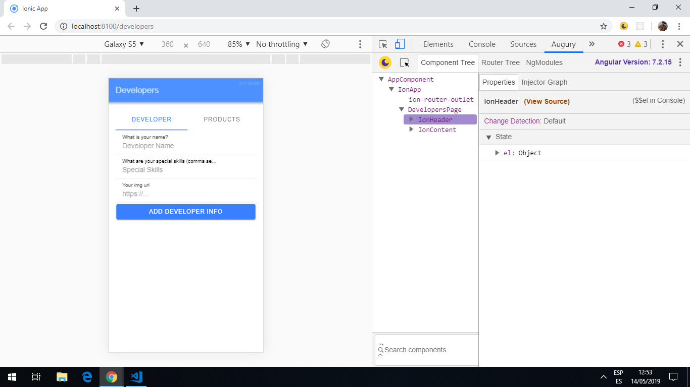
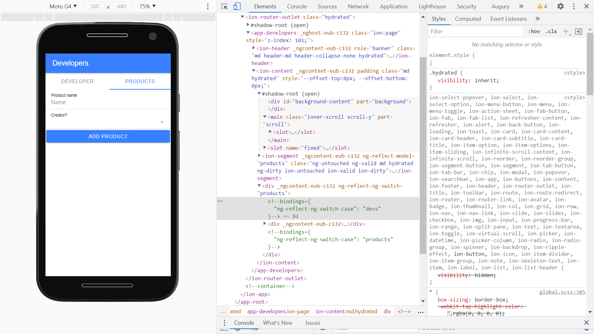

# Ionic Angular SQLite

App to store data using the [Ionic 4 framework](https://ionicframework.com/docs), [cordova SQLite database](https://ionicframework.com/docs/native/sqlite) & [SQLite Porter](https://ionicframework.com/docs/native/sqlite-porter) and [Capacitor](https://capacitor.ionicframework.com/).

## Table of contents

* [General info](#general-info)
* [Screenshots](#screenshots)
* [Technologies](#technologies)
* [Setup](#setup)
* [Features](#features)
* [Status](#status)
* [Inspiration](#inspiration)
* [Contact](#contact)

## General info

* App allows user to add details of developer and products. Initial seed data is a short list of developers and dev skills.

## Screenshots




## Technologies

* [Ionic/angular v4.4.2](https://ionicframework.com/)

* [Ionic v5.6.1](https://ionicframework.com/docs/cli)

* [Angular 8.0.0](https://angular.io/)

* [cordova plugin SQLite database v3.2.0](https://ionicframework.com/docs/native/sqlite)

* [cordova SQLite Porter v1.1.0](https://ionicframework.com/docs/native/sqlite-porter)

## Setup

* To start the server on _localhost://8100_ type: 'ionic serve'

## Code Examples

* `database.service.ts` function to get details of a developer from the database.

```typescript
getDeveloper(id): Promise<Dev> {
  return this.database.executeSql('SELECT * FROM developer WHERE id = ?', [id]).then(data => {
    let skills = [];
    if (data.rows.item[0].skills !== '') {
      skills = JSON.parse(data.rows.item[0].skills);
    }

    return {
      id: data.rows.item(0).is,
      name: data.rows.item(0).name,
      skills,
      img: data.rows.item[0].img
    };
  });
}
```

## Features

* storage of data in an SQL database.

* updated to Angular 8.

## Status & To-do list

* Status: compiles and displays in a dev server. Build webpacks created. Needs implementing on an Android device or simulator to use database etc. Database side not tested.

* To-do: test database to see if it stores Dev and Product details.

## Inspiration

* [devdactic: How to Build an Ionic 4 App with SQLite Database & Queries (And Debug It!)](https://devdactic.com/ionic-4-sqlite-queries/).

## Contact

Repo created by [ABateman](https://www.andrewbateman.org) - feel free to contact me!
